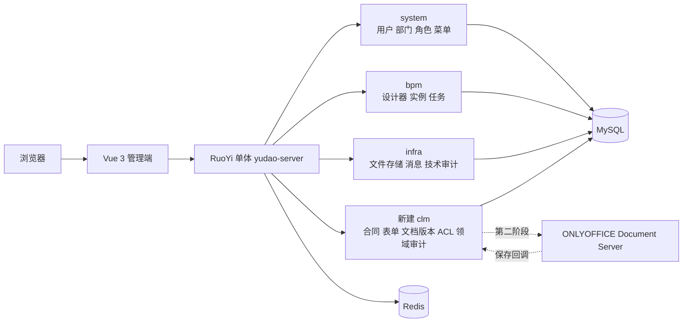

# RuoYi-Vue-Pro 合同系统 POC：本地搭建与技术实施交接

> 更新日期：2026-08-24
>
>
> 文档性质：给下一次开发会话的执行说明，不是 PRD、需求评审稿或原型说明。

## 0. 给下一会话的直接指令

目标是**在本机落代码并跑通纵向闭环**，不要继续写 PRD 或制作原型。

执行顺序必须是：

1. 固定上游版本并在 `clm/backend`、`clm/frontend` 克隆源码；
2. 先原样跑通 RuoYi-Vue-Pro 基础版，留下启动证据；
3. 解决 BPM 初始化 SQL 的合法授权问题，再启用 BPM；
4. 新建独立 `yudao-module-clm`，完成合同、表单、文档版本、审批、权限的最小闭环；
5. 基础闭环稳定后，才接 ONLYOFFICE；
6. 每个阶段都运行对应测试并记录实际结果，不能只根据菜单、源码或启动日志宣称功能完成。

只在出现以下阻塞时询问用户：需要购买 BPM SQL/商业授权、需要选择在线文档付费方案、需要改变已锁定范围，优先在本地尝试，暂时不商用不用考虑风险。其余本地安装、建表、编码、修错和验证自行推进。

## 1. 项目背景

这是一个“业、财、法一体”的企业合同系统项目，整体合同金额约 **30 万元**。计划用 AI 辅助开发，人员配置约为：

- 前端 1 人；
- 后端 1 人；
- 测试 2 人；
- 交付周期 2—3 个月；
- 商业目标是以低成本组装成熟能力，按期交付并基本覆盖成本，而不是从零建设通用低代码平台。

前期关注的三类基础能力是：

1. 类似飞书审批的画布式流程配置和自定义表单；
2. Word 类文档在线编辑、不可变历史版本和版本比较；
3. 企业成员、部门、角色以及合同级数据权限。

Warm-Flow、FormCreate、国内管理系统框架和可交付源码产品已经做过初步比较。本次 POC 明确采用 **RuoYi-Vue-Pro 单体版**，验证它能否以较小二开成本提供成熟的用户/组织/RBAC、基础设施和审批底座。虽然现有后端团队主要使用 Go，但本轮不做 Java/Go 混合重写；先用完整 Java 单体验证交付效率，再根据一周实测成本决定是否继续。

RuoYi-Vue-Pro 是管理与流程底座，不是现成 CLM。合同、合同文档版本、合同级权限和领域审计仍需自建。

## 2. 已锁定决策

以下不是开放问题，下一会话不得自行改回：

| 决策 | 实施含义 |
|---|---|
| 不单独建立“合同申请”对象 | 用户发起时直接创建 `clm_contract` 草稿；驳回仍保留为合同草稿/驳回记录，通过状态过滤正式台账。 |
| 不做电子签 | 不接 CA、电子签平台、印章硬件、签署位置、签署顺序和保全存证。P1 可手工上传线下签完的最终 PDF/DOCX 并归档，但它不是电子签。 |
| 采用 RuoYi-Vue-Pro 单体版 | 不拆微服务，不在 POC 内用 Go 重写 system/bpm/infra。 |
| CLM 独立模块 | 新建 `yudao-module-clm`；不修改或扩展销售语义很强的 `crm_contract`。 |
| 合同是第一业务轴 | 一个 `contract_id` 贯穿草稿、审批、定稿、后续生效/归档；流程和文件都不是合同主记录。 |
| 主字段 + JSON 扩展字段 | 金额、主体、日期、负责人等稳定字段使用业务列；合同类型的动态字段使用版本化 FormCreate schema 和 `custom_data` JSON。 |
| 业务表单接 BPM | 合同数据以 CLM 业务表为事实源，RuoYi BPM 只负责流程定义、实例和任务，不把整份合同塞进流程变量。 |
| 文档版本不可覆盖 | 每次上传或在线保存都新增 `clm_document_version`；审批绑定准确版本与校验和。 |
| 权限必须落到服务端 | 菜单/RBAC 只做粗粒度入口控制；合同详情、列表、编辑和下载都必须经过合同级授权判断。 |

## 3. POC 成功标准

### 3.1 必须跑通的纵向闭环

1. 管理员创建合同类型，使用 FormCreate 配置扩展字段并发布一个不可变类型版本；
2. 管理员在 RuoYi 的 SIMPLE/BPMN 设计器配置 `clm_contract_approval_v1` 审批流；
3. 经办人直接创建合同草稿，不经过“合同申请”；
4. 经办人填写核心字段和动态字段，上传 DOCX，系统形成正文版本 v1；
5. 经办人提交审批，审批实例绑定合同、合同类型版本、正文版本、表单快照和校验和；
6. 审批人在 RuoYi 待办中打开合同业务详情并通过或驳回；
7. CLM 监听审批结果并更新审批状态，保留完整轨迹；
8. 未授权用户看不到合同，也不能绕过 UI 下载文件；
9. 合同详情可查看不可变版本列表、创建人、时间、来源、校验和并受控下载；
10. 基础闭环通过后，验证 ONLYOFFICE 打开真实 DOCX、保存回调生成新版本、查看历史版本；版本“比较”必须用真实文件验证，不能只做两个文件名并排展示。

### 3.2 POC 明确不做

- 独立合同申请、法务工单或一申请拆多合同；
- 电子签、CA、印控、签章位置和法律保全；
- 条款库、逐条红线、AI 审查或 AI 风险评分；
- 外部供应商/客户门户；
- ERP、SRM、CRM、财务凭证和支付的真实集成；
- 复杂履约义务、付款计划、发票、收付款和自动续签；
- 多人并行文档分支与合并；
- SaaS 运营后台、多区域部署、信创适配和微服务化；
- 用 RuoYi 代码生成器堆满菜单但没有端到端业务闭环。

## 4. 固定的技术基线

不要直接跟随持续变化的 `master` 分支。POC 固定到 2026.07 发布标签：

| 部分 | 仓库 / 版本 | 固定 commit | 说明 |
|---|---|---|---|
| 后端 | [YunaiV/ruoyi-vue-pro](https://github.com/YunaiV/ruoyi-vue-pro) `v2026.07(jdk17/21)` | `ec3f7cbf73e88514a70a6b59d365092ee470603d` | Java 17 单体版；根仓库 MIT。 |
| 前端 | [yudaocode/yudao-ui-admin-vue3](https://github.com/yudaocode/yudao-ui-admin-vue3) `v2026.07` | `d4b521a169ff430824ec92235dc4a0fec378f253` | Vue 3 + Element Plus，已包含 FormCreate 和 BPM 页面。 |
| 数据库 | MySQL 8.0.x | POC 建议固定 `mysql:8.0.33` | 使用 JSON 字段；不要在中途换数据库。 |
| 缓存 | Redis 7 | `redis:7-alpine` | 仅做 RuoYi 运行依赖。 |
| 在线文档 | ONLYOFFICE Document Server | 接入时再固定经验证的镜像 digest | 先做独立 Gate，不与基础 CLM 同时开工。 |

固定版本核验：

```bash
cd /Users/ricky/.codex/worktrees/111e/requirements/clm

git clone --branch 'v2026.07(jdk17/21)' --single-branch \
  https://github.com/YunaiV/ruoyi-vue-pro.git backend
git -C backend switch -c codex/clm-poc

git clone --branch v2026.07 --single-branch \
  https://github.com/yudaocode/yudao-ui-admin-vue3.git frontend
git -C frontend switch -c codex/clm-poc

git -C backend rev-parse HEAD
git -C frontend rev-parse HEAD
```

如果 commit 与表中不一致，停止后续编码，先查明是不是拉错标签。

建议目录：

```text
clm/
├── README.md                 # 本交接文档
├── backend/                  # 独立 Git 仓库
├── frontend/                 # 独立 Git 仓库
├── infra/
│   ├── compose.yaml          # MySQL、Redis；后续可加 ONLYOFFICE
│   └── .env                  # 仅本地使用，不提交
└── runtime/                  # 本地数据、测试文件和日志，不提交
```

`clm` 当前位于 requirements 工作树内。下一会话必须让父仓库忽略 `backend/`、`frontend/`、`runtime/` 和所有 `.env`，不要把两个完整上游仓库误提交到 requirements 仓库。

## 5. 当前本机状态与首次启动

截至 2026-08-24 的只读检查结果：Apple Silicon `arm64`；Docker CLI、Node `v23.11.0`、pnpm `11.19.0` 已存在；Java 和 Maven 尚未安装；Docker daemon 需要启动后复查。

前端固定版本要求 Node `>=20.19.0`、pnpm `>=8.6.0`，当前满足。后端使用 JDK 17，Maven 建议 3.9.x。

### 5.1 安装并检查运行时

```bash
brew install openjdk@17 maven

export JAVA_HOME="/opt/homebrew/opt/openjdk@17/libexec/openjdk.jdk/Contents/Home"
export PATH="/opt/homebrew/opt/openjdk@17/bin:$PATH"

java -version
mvn -version
node --version
pnpm --version
docker info
```

若 Homebrew 的 Java 安装路径不同，以 `brew --prefix openjdk@17` 和 `/usr/libexec/java_home -V` 的实测结果为准，不要硬改系统 Java。

### 5.2 本地基础设施

下一会话创建 `infra/compose.yaml`，只包含 MySQL 和 Redis。数据库密码放在未提交的 `infra/.env`，不要把真实凭据写入仓库、日志或本文档。

```yaml
services:
  mysql:
    image: mysql:8.0.33
    container_name: clm-mysql
    environment:
      MYSQL_DATABASE: ruoyi-vue-pro
      MYSQL_ROOT_PASSWORD: ${CLM_DB_PASSWORD:?set CLM_DB_PASSWORD in infra/.env}
    ports:
      - "3306:3306"
    command:
      - --character-set-server=utf8mb4
      - --collation-server=utf8mb4_unicode_ci
      - --default-storage-engine=INNODB
    volumes:
      - clm-mysql-data:/var/lib/mysql
    healthcheck:
      test: ["CMD-SHELL", "mysqladmin ping -h 127.0.0.1 -uroot -p$$MYSQL_ROOT_PASSWORD --silent"]
      interval: 5s
      timeout: 5s
      retries: 20

  redis:
    image: redis:7-alpine
    container_name: clm-redis
    ports:
      - "6379:6379"
    volumes:
      - clm-redis-data:/data
    healthcheck:
      test: ["CMD", "redis-cli", "ping"]
      interval: 5s
      timeout: 3s
      retries: 20

volumes:
  clm-mysql-data:
  clm-redis-data:
```

启动和导入基础 SQL：

```bash
cd /Users/ricky/.codex/worktrees/111e/requirements/clm
docker compose --env-file infra/.env -f infra/compose.yaml up -d
docker compose --env-file infra/.env -f infra/compose.yaml ps

set -a
source infra/.env
set +a
docker compose --env-file infra/.env -f infra/compose.yaml exec -T mysql \
  mysql -uroot -p"$CLM_DB_PASSWORD" ruoyi-vue-pro \
  < backend/sql/mysql/ruoyi-vue-pro.sql
```

警告：官方基础 SQL 含 `DROP TABLE`，不能对有价值的数据重复执行。POC 重建前也必须先确认目标确实是 `clm-mysql` 的可丢弃本地库。

### 5.3 后端本地配置与启动

不要把密码改死在官方 `application-local.yaml`。新增不含秘密值的 `application-clm-local.yaml`，从环境变量读取数据库配置，并以 `local,clm-local` 两个 profile 启动。

```yaml
spring:
  datasource:
    dynamic:
      datasource:
        master:
          url: ${CLM_DB_URL:jdbc:mysql://127.0.0.1:3306/ruoyi-vue-pro?useSSL=false&serverTimezone=Asia/Shanghai&allowPublicKeyRetrieval=true&rewriteBatchedStatements=true}
          username: ${CLM_DB_USERNAME:root}
          password: ${CLM_DB_PASSWORD}
        slave:
          lazy: true
  data:
    redis:
      host: ${CLM_REDIS_HOST:127.0.0.1}
      port: ${CLM_REDIS_PORT:6379}
```

先在**尚未启用 BPM、尚未新增 CLM 模块**的上游基线运行：

```bash
cd /Users/ricky/.codex/worktrees/111e/requirements/clm/backend
set -a
source ../infra/.env
set +a
mvn -pl yudao-server -am clean package -DskipTests
java -jar yudao-server/target/yudao-server.jar \
  --spring.profiles.active=local,clm-local
```

基线验收：

```bash
curl -i http://127.0.0.1:48080/
```

预期是服务可达并返回未登录的 JSON 响应，而不是连接失败或 HTML 代理错误。接口文档默认可从 `http://127.0.0.1:48080/doc.html` 检查。

### 5.4 前端启动

```bash
cd /Users/ricky/.codex/worktrees/111e/requirements/clm/frontend
pnpm install --frozen-lockfile
pnpm exec vite --mode env.local --port 3000
```

访问 `http://localhost:3000`，后端应为 `http://localhost:48080`，API 前缀为 `/admin-api`。不要用 `sudo` 占用 80 端口，也不要运行会连接远端环境的前端脚本。默认本地管理员账号来自官方初始化 SQL；首次登录后只在本地密码管理器中记录并立即修改，不在交付文档中传播。

前端依赖安装如果因官方锁文件中的镜像 URL 被本地供应链策略拦截，应先核对标签和 lockfile 来源，再根据当前 Codex/pnpm 的提示做一次性信任；不要随意删除 lockfile 或改成非冻结安装。

## 6. 必须先解决的 BPM 授权 Gate

RuoYi-Vue-Pro 的公开代码仓默认关闭 `yudao-module-bpm`。启用需要：

1. 根 `pom.xml` 取消 `yudao-module-bpm` 的 module 注释；
2. `yudao-server/pom.xml` 取消 `yudao-module-bpm` 依赖注释；
3. 向同一数据库导入 `bpm_*` 业务表 SQL；
4. 由 Flowable 首次启动创建 `ACT_*`、`FLW_*` 引擎表。

关键限制：公开的 `sql/mysql/ruoyi-vue-pro.sql` **没有 `bpm_*` 建表语句**。截至本文核验时间，[官方 BPM 开启文档](https://doc.iocoder.cn/bpm/)要求另行下载 `bpm-2025-10-04.sql.zip`，并对该 SQL 声明了芋道星球成员与商用授权条件。根代码仓的 MIT 许可不能自动证明这份单独 SQL 可免费商用。

因此下一会话必须把这件事作为 Gate，而不是绕过：

- 优先向作者确认并取得可用于本项目、可部署交付的授权及 SQL；
- 记录一次性购买/会员费、续费、源码交付、客户部署和白标权利；
- 未取得授权前，只能跑 system/infra 和 CLM CRUD，不能宣称审批流完成；
- 不复制来源不明的 BPM SQL，也不把测试资源里的建表脚本当生产脚本；
- 如果合法取得的成本或条款不合适，应暂停 RuoYi BPM 接入并重新比较 Warm-Flow，而不是投入人力反向复刻芋道 BPM 数据层。

取得授权 SQL 后，先导入，再启用两处 POM。验收必须同时满足：

- 数据库存在 `bpm_*`；
- 启动后存在 `ACT_*` 和 `FLW_*`；
- 后端 BPM API 可访问；
- 前端能创建、发布并实际执行一个两节点测试流程；
- 不是仅仅“工作流程菜单可见”。基础 SQL 已含部分菜单/字典，菜单可见不代表 BPM 可用。

## 7. 总体架构和复用边界



| 能力 | 复用 RuoYi | CLM 自建边界 |
|---|---|---|
| 成员与组织 | tenant、user、dept、post、role | 内部签约主体不是部门；合同参与人和对象权限另建。 |
| 功能权限 | 菜单、按钮、接口权限码 | 不能仅靠 RBAC 决定合同正文与下载权限。 |
| 流程 | SIMPLE/BPMN 设计器、定义、实例、任务、审批动作、评论 | 合同与多次流程的绑定、准确版本快照、状态监听。 |
| 表单 | 前端已有 FormCreate 设计器和运行时 | 合同类型版本、稳定业务字段、扩展 schema 与数据。 |
| 文件 | `infra_file` 及文件存储适配 | 文档语义、不可变版本、校验和、冻结、受控下载。 |
| 数据权限 | 部门数据范围可作粗筛 | 合同参与人/ACL、服务层查询过滤、下载审计。 |
| CRM 合同 | 不复用 | `crm_contract` 绑定客户、商机、产品和销售回款，不是通用 CLM。 |

## 8. 代码模块设计

### 8.1 后端

在根 POM 增加 module，在 `yudao-server/pom.xml` 增加依赖：

```text
yudao-module-clm/
├── pom.xml
└── src/
    ├── main/java/cn/iocoder/yudao/module/clm/
    │   ├── controller/admin/
    │   ├── service/
    │   ├── dal/dataobject/
    │   ├── dal/mysql/
    │   ├── enums/
    │   ├── workflow/          # BPM API、绑定和状态监听
    │   ├── document/          # 文件存储和 ONLYOFFICE 适配接口
    │   └── access/            # 合同 ACL、查询约束和领域审计
    └── test/java/cn/iocoder/yudao/module/clm/
```

依赖方向：`clm -> system-api / infra-api / bpm-api`。避免 CLM 直接修改其他模块的 mapper 或表；跨模块优先用现有 API。若现有 API 缺失，先在调用边界加 CLM 适配器，不要散落跨模块查询。

### 8.2 前端

```text
src/
├── api/clm/
│   ├── contract/
│   ├── contractType/
│   ├── party/
│   └── document/
├── views/clm/
│   ├── contract/index.vue
│   ├── contract/create/index.vue
│   ├── contract/detail/index.vue
│   ├── contractType/index.vue
│   └── party/index.vue
└── components/clm/
    ├── ContractDynamicForm.vue
    ├── ContractParticipants.vue
    └── DocumentVersionList.vue
```

RuoYi BPM 业务表单配置：

- 表单类型：业务表单 / CUSTOM（值 20）；
- 提交路由：`/clm/contract/create`；
- 查看组件全路径：`/clm/contract/detail/index.vue`；
- POC 流程定义 key：`clm_contract_approval_v1`。

注意：查看地址不是普通页面 URL。固定前端版本会按组件全路径动态注册业务详情组件。

## 9. 最小数据模型

所有表沿用 RuoYi 的 `BaseDO` 字段约定，并补 `tenant_id`、逻辑删除。主键使用框架的 Long ID；金额使用 `DECIMAL`，时间使用明确时区约定；JSON 仅存动态扩展和快照。

### 9.1 P0 十张表

| 表 | 关键字段 | 关键约束 |
|---|---|---|
| `clm_contract_type` | `id, code, name, status, current_version_id` | `tenant_id + code` 唯一；只保存身份和当前发布指针。 |
| `clm_contract_type_version` | `type_id, version_no, schema_json, option_json, process_definition_key, status, published_at` | 发布后不可修改；合同固定引用该版本。 |
| `clm_party` | `party_type, name, unified_credit_code, internal_flag, source_type, source_id, status` | 我方主体和相对方统一建模；POC 只做必要字段。 |
| `clm_contract` | `contract_no, title, type_id, type_version_id, owner_user_id, owner_dept_id, amount, currency, effective_date, expiry_date, custom_data, lifecycle_status, approval_status, current_document_version_id, row_version` | 发起即创建；无 `request_id`；合同生命周期与审批状态分开。 |
| `clm_contract_party` | `contract_id, party_id, role_code, sort, party_snapshot` | 一份合同至少一个我方主体、一个相对方；保存签约时快照。 |
| `clm_document` | `contract_id, role_code, name, current_version_id, status` | POC 至少支持一份 `MAIN` 正文；附件可复用同一模型。 |
| `clm_document_version` | `document_id, version_no, parent_version_id, file_id, file_name, mime_type, file_size, checksum_sha256, source_type, frozen` | `document_id + version_no` 唯一；内容永不覆盖；审批版本必须冻结。 |
| `clm_workflow_binding` | `contract_id, purpose, process_definition_key, process_definition_id, process_instance_id, document_version_id, contract_type_version_id, form_snapshot, checksum_sha256, status` | 一次流程一个 binding；同一合同可重提和启动多种流程。 |
| `clm_contract_participant` | `contract_id, principal_type, principal_id, role_code, can_view, can_edit, can_download, can_manage` | `contract + principal` 唯一；POC 先支持 USER，DEPT/ROLE 可随后扩展。 |
| `clm_audit_event` | `aggregate_type, aggregate_id, action, actor_user_id, detail_json, occurred_at` | 追加式记录，不覆盖；至少审计创建、修改、提交、决定、上传、下载和授权。 |

状态枚举至少分成两条正交状态轴：

- `lifecycle_status`：`DRAFT / APPROVED / EFFECTIVE / EXPIRED / TERMINATED / VOID`；
- `approval_status`：`NOT_SUBMITTED / RUNNING / APPROVED / REJECTED / CANCELED`。

审批通过只把审批状态置为 `APPROVED`，不能自动宣称合同已经签署或生效。线下签署文件和生效信息由后续人工归档动作登记。

必须建立的索引：

- `clm_contract(tenant_id, owner_user_id, approval_status)`；
- `clm_contract(tenant_id, owner_dept_id, lifecycle_status)`；
- `clm_contract(tenant_id, contract_no)` 唯一但允许编号暂为空；
- `clm_document_version(document_id, version_no)` 唯一；
- `clm_workflow_binding(process_instance_id)` 唯一；
- `clm_contract_participant(contract_id, principal_type, principal_id)` 唯一；
- `clm_audit_event(aggregate_type, aggregate_id, occurred_at)`。

### 9.2 暂不建表

模板、条款、履约、付款、发票、合同关系、电子签、归档箱等不进入第一个纵向闭环。在线文档验证成功后，可增加 `clm_contract_template / clm_template_version`；需要手工归档时再增加 `clm_archive_record`。不要提前一次性生成几十张空表。

## 10. 最小 API

统一前缀为 `/admin-api/clm`，沿用 RuoYi 的返回体、分页、校验、权限注解和错误码规范。

| 方法 | 路径 | 用途 |
|---|---|---|
| `POST` | `/contract-type` | 创建合同类型草稿 |
| `PUT` | `/contract-type/{id}` | 更新未发布类型版本 |
| `POST` | `/contract-type/{id}/publish` | 发布不可变类型版本 |
| `GET` | `/contract-type/{id}`、`/contract-type/page` | 详情与分页 |
| `POST`、`PUT` | `/party`、`/party/{id}` | 维护签约方 |
| `GET` | `/party/page` | 签约方选择与分页 |
| `POST` | `/contract` | 直接创建合同草稿 |
| `PUT` | `/contract/{id}` | 更新有编辑权且未冻结的草稿 |
| `GET` | `/contract/{id}`、`/contract/page` | 详情与经过 ACL 过滤的分页 |
| `POST` | `/contract/{id}/documents` | 上传文件并形成新文档版本 |
| `GET` | `/contract/{id}/documents` | 文档列表 |
| `GET` | `/document/{id}/versions` | 不可变版本列表 |
| `GET` | `/document/version/{versionId}/download` | CLM 授权检查后的受控下载 |
| `POST` | `/contract/{id}/submit` | 冻结准确版本并发起审批 |
| `PUT` | `/contract/{id}/participants` | 管理合同参与人和权限 |
| `GET` | `/contract/{id}/audit-events` | 领域审计轨迹 |

审批同意、驳回、转办等动作复用 RuoYi BPM 已有任务 API，不在 CLM 重写一套。

权限码最少包括：`clm:contract:query/create/update/submit/download/manage-member`、`clm:contract-type:*`、`clm:party:*`。按钮权限只是第一层，Service 仍须校验对象权限。

## 11. FormCreate 实施规则

前端固定版本已经包含 `@form-create/designer` 和 Element Plus 运行时，不需要再选第二套动态表单组件。

1. 合同类型编辑器输出 `schema_json + option_json`；
2. 类型版本在发布前可编辑，发布后只读；修改配置必须创建新版本；
3. 新合同固定保存 `type_version_id`，历史合同不跟随类型最新配置漂移；
4. 标题、编号、金额、币种、我方主体、相对方、负责人、部门、生效/到期日等进入稳定列；
5. 低频、类型特有字段进入 `custom_data`，后端按固定 schema 校验，不能只相信前端；
6. POC 不做任意 JSON 字段的复杂报表。如果某扩展字段进入跨类型统计，再迁移为稳定列或专用索引表；
7. BPM 流程变量只传审批路由需要的少量标量，例如金额、部门、合同类型，不能传完整 DOCX 或整份 JSON。

## 12. BPM 绑定的准确实现

发起审批时按一个事务语义执行：

1. 校验当前用户的 `submit` 权限、合同状态、必填字段和正文版本；
2. 冻结当前 `document_version_id`，计算/复核 SHA-256；
3. 创建 `clm_workflow_binding`，状态为 `PREPARING`，保存合同类型版本与表单快照；
4. 调用 `BpmProcessInstanceApi.createProcessInstance(...)`；
5. `businessKey` 使用 **workflow binding ID**，不是 contract ID；这样重提或一合同多流程不会冲突；
6. 流程变量只传 `contractId, bindingId, amount, ownerDeptId, contractTypeCode` 等审批路由字段；
7. 回写 `process_instance_id`，binding 和合同审批状态改为 `RUNNING`；
8. 任何一步失败，事务回滚；外部文件若已上传但数据库失败，记录补偿清理任务。

审批结果由继承 `BpmProcessInstanceStatusEventListener` 的 CLM 监听器接收。POC 固定一个 key `clm_contract_approval_v1`，从事件 `businessKey` 取 binding ID，再更新 binding 和合同 `approval_status`。驳回后允许经办人新建正文版本并重新提交；旧 binding 永久保留。

POC 为降低状态复杂度，审批 `RUNNING` 时禁止修改已绑定正文。批准后该版本永久冻结。后续若要修改合同，必须形成新版本和新审批实例。

## 13. 文档版本、在线编辑和比较

### 13.1 第一阶段：先跑通不可变版本

- 上传进入 RuoYi 文件存储，但 `infra_file` 仅是 blob 引用；
- CLM 计算 SHA-256 并创建新的 `clm_document_version`；
- `source_type` 至少区分 `UPLOAD`、`ONLINE_EDIT`、`MANUAL_FINAL`；
- 任何“替换文件”都生成新版本，禁止更新旧版本的 `file_id`；
- 所有下载走 CLM 受控接口，不能把默认文件公开 URL 当合同下载地址；
- 审批详情必须展示并下载 binding 绑定的版本，而不是“当前最新版”。

固定后端版本存在一个必须封堵的安全边界：`FileController` 的 `/{configId}/get/**` 下载接口带有 `@PermitAll` 和 `@TenantIgnore`。因此“文件存进 `infra_file`，但前端不显示原始 URL”并不等于私有文件。

POC 至少选择并验证一种保护方案：

1. 推荐：实现 `ClmDocumentStorage` 适配器，底层可继续调用 RuoYi 文件存储，但对 `clm-private/{tenantId}/{contractId}/...` 的原始 infra 下载路径增加前置拦截，只允许 CLM 在通过对象 ACL 后读取/转发；
2. 或使用不暴露公共读取路由的私有对象桶/私有本地存储，CLM 后端鉴权后返回短时预签名 URL 或文件流；
3. 不接受：依靠长 URL、随机文件名、前端隐藏按钮或不返回 `file_id` 作为保护。

验收时必须复制底层原始 URL，在未登录和无权账号下直接请求，确认均不能得到文件内容；同时验证 CLM 受控下载可以正常工作并写入审计事件。

### 13.2 第二阶段：ONLYOFFICE 独立 Gate

ONLYOFFICE 不是基础启动的前置条件。只有上传、版本、权限、审批闭环通过后才接：

1. 固定一个同时支持本机 `arm64` 的 Document Server 镜像和 digest；
2. 使用随机 JWT secret，通过未提交环境变量注入；
3. 编辑配置中的 `document.key` 必须与文档/版本/编辑会话稳定对应，不能只用文件名；
4. callback URL 必须能被容器访问，校验 JWT、合同权限、文档状态和回调状态码；
5. 保存回调从 Document Server 拉取新文件，计算校验和并插入新版本，绝不覆盖原文件；
6. 对真实 DOCX 验证中文字体、批注、修订、页眉页脚、表格、保存回调、历史打开和并发；
7. 历史比较必须验证 OnlyOffice history/compare 的真实交互、版本数据和恢复行为。若社区版或当前集成无法满足，不把“版本列表”包装成“版本对比”；明确降级为历史下载/并排查看，或单独评估付费服务。

ONLYOFFICE Document Server 社区版采用 AGPLv3。POC 可做技术验证，但正式交付前必须单独确认网络使用、修改、分发、品牌展示、并发和升级等义务；不要只因镜像可下载就认定可无条件商用。

### 13.3 不做电子签后的闭环

P0 到“审批通过的冻结定稿版”为止。若客户仍需要签后台账，P1 增加：上传线下签署后的最终文件、登记签署日期/生效日期、标记 `MANUAL_FINAL`、生成归档记录。这是人工回传和归档，不接任何电子签能力。

## 14. 成员与权限模型

权限判断按以下顺序统一在 Service 层执行：

1. tenant 隔离；
2. RuoYi 菜单/按钮/API 功能权限；
3. 合同 owner 或 `clm_contract_participant` 授权；
4. 具体动作 `view/edit/download/manage`；
5. 合同和文档当前状态是否允许该动作；
6. 写入领域审计。

平台运维管理员或企业管理员不应因“管理员”身份自动获得所有合同正文。确需紧急访问时，应设计显式的受审计授权，而不是在 POC 中写一个无条件超级用户旁路。

列表权限不能先查全量再由前端隐藏。Mapper/Service 查询必须直接加入 owner、参与人、授权部门等条件；详情和下载再做一次对象校验，防止 ID 枚举。预签名 URL 应短时有效且在授权后生成。

## 15. 分阶段实施与验收门槛

| 阶段 | 后端主任务 | 前端主任务 | 测试门槛 | 预计 |
|---|---|---|---|---|
| 0. 基线 | 固定版本、MySQL/Redis、基础 SQL、启动 server | 安装依赖、登录基础后台 | 记录 commit、启动命令、端口和截图 | 1—2 天 |
| 1. BPM Gate | 取得授权 SQL、启用模块、跑通两节点流程 | 验证 SIMPLE/BPMN、待办和详情 | 真正创建并处理实例，不以菜单替代 | 1—3 天，授权等待除外 |
| 2. CLM 骨架 | module、SQL、错误码、权限码、CI 测试 | 菜单、路由、API 封装 | 模块单测、迁移可重复、基线不回归 | 2—3 天 |
| 3. 合同与表单 | 类型版本、Party、合同 CRUD、后端 schema 校验 | FormCreate 设计/运行、列表/创建/详情 | 发布后不可改、历史 schema 不漂移 | 1 周 |
| 4. 文档版本 | 上传、校验和、版本链、受控下载 | 上传和版本列表 | 覆盖、越权下载、错误文件回滚 | 1 周 |
| 5. 审批闭环 | binding、BPM API、状态监听、重提 | 业务表单详情、提交入口、审批轨迹 | 通过/驳回/取消/重提均绑定正确版本 | 1 周 |
| 6. ACL 与审计 | 查询过滤、动作校验、审计事件 | 成员配置和只读态 | owner/参与人/无权人/管理员四类矩阵 | 1 周 |
| 7. 在线文档 Gate | ONLYOFFICE 配置、JWT、回调、新版本 | 在线编辑、历史/比较入口 | 用真实 DOCX 跑开、存、历史、比较、越权 | 1 周 |
| 8. 收尾 | 手工最终版/归档（若需要）、迁移和安全加固 | 状态和异常体验 | E2E、回归、部署演练、许可证清单 | 1—2 周 |

每个后端阶段至少运行：

```bash
cd clm/backend
mvn -pl yudao-module-clm -am test
mvn -pl yudao-server -am clean package -DskipTests
```

每个前端阶段至少运行：

```bash
cd clm/frontend
pnpm ts:check
pnpm lint
pnpm build:local
```

如果上游仓库本身在固定 tag 就存在 lint/test 基线失败，先留存原样基线证据，再证明本次新增代码没有扩大失败；不要静默跳过。

## 16. 核心验收用例

1. 创建操作直接产生合同草稿，数据库不存在 ContractRequest 主对象；
2. 发布合同类型 v1 后不可修改；发布 v2 不改变旧合同；
3. 上传同名 DOCX 两次产生两个版本，v1 内容和 checksum 不变；
4. 发起审批时正文版本和表单快照准确冻结；
5. 审批任务详情读取 binding 绑定版本，不随“当前版本”漂移；
6. 驳回后修改形成 v2，再提交产生新 binding 和新流程实例；
7. 审批通过后旧版本不可覆盖；
8. 无权限用户的列表、详情和下载均被服务端拒绝；
9. 普通系统管理员默认不能读取未授权合同正文；
10. 授权新增/撤销立即作用于详情和下载，并产生审计事件；
11. 不同 tenant 的 ID 即使猜中也不能访问；
12. ONLYOFFICE 保存回调生成新版本；重复回调幂等，不产生重复版本；
13. 在线编辑会话无权、过期、冻结和审批中状态均被拒绝；
14. 全链路没有电子签、CA、签章或印控依赖。

## 17. 成本控制和停止条件

这个项目不能按“大平台”方式铺开。遇到以下情况应立即停下来做选择：

- **BPM 授权**：3 个工作日内仍无法确认 SQL 的合法商用和交付权，暂停 BPM 开发，核算购买芋道授权与替换 Warm-Flow 两条路径；
- **Java 团队成本**：基线 + CLM 空模块 + 一个 CRUD 在一周内仍无法稳定开发/测试，说明 Go 团队转 Java 的实际成本过高，应重新评估底座；
- **在线文档**：2—3 天技术 Gate 仍无法稳定完成真实 DOCX 打开、保存回调和历史，先保留上传/下载版本闭环，再比较 WPS WebOffice 或其他付费服务；
- **权限复杂度**：客户要求字段级密级、动态策略、跨法人矩阵或外部协作时，必须单独估价，不能塞入 30 万首期；
- **范围扩张**：电子签、AI 审查、ERP/财务、履约、外部门户任何一项进入首期，都要对应削减范围或追加预算。

采购/授权至少书面确认：源码范围、商用权、二开权、客户部署权、白标/水印、用户或并发限制、升级和续费、漏洞修复、停止续费后的永久使用权。公开仓库、演示站和“提供源码”均不能替代这些权利。

## 18. 下一会话的第一批任务

下一会话直接完成以下动作并把实际结果写进其工作日志：

1. 创建父目录忽略规则和 `infra/compose.yaml`；
2. 按固定 tag 克隆前后端，核对 commit；
3. 安装 JDK/Maven，启动 Docker，导入基础 SQL；
4. 原样启动后端和前端，完成一次本地登录；
5. 保存基线的命令、日志、端口、表数量和截图；
6. 检查用户是否已合法取得 BPM SQL。没有就明确报告唯一阻塞，同时继续完成不依赖 BPM 的 CLM 模块骨架；
7. BPM 可用后先创建一个最小两节点业务表单流程，再开始合同业务开发；
8. 第一条业务切片只做：**直接创建合同 → 上传不可变 v1 → 提交审批 → 通过/驳回 → 受控下载**。

## 19. 主要依据

- [RuoYi-Vue-Pro 官方仓库](https://github.com/YunaiV/ruoyi-vue-pro)
- [RuoYi-Vue-Pro 快速启动](https://doc.iocoder.cn/quick-start/)
- [RuoYi-Vue-Pro BPM 功能开启](https://doc.iocoder.cn/bpm/)
- [审批接入：业务表单](https://doc.iocoder.cn/bpm/use-business-form/)
- [审批接入：流程表单](https://doc.iocoder.cn/bpm/use-bpm-form/)
- [RuoYi 数据权限](https://doc.iocoder.cn/data-permission/)
- [RuoYi Vue 3 管理端仓库](https://github.com/yudaocode/yudao-ui-admin-vue3)
- [ONLYOFFICE Document Server Docker 仓库](https://github.com/ONLYOFFICE/Docker-DocumentServer)
